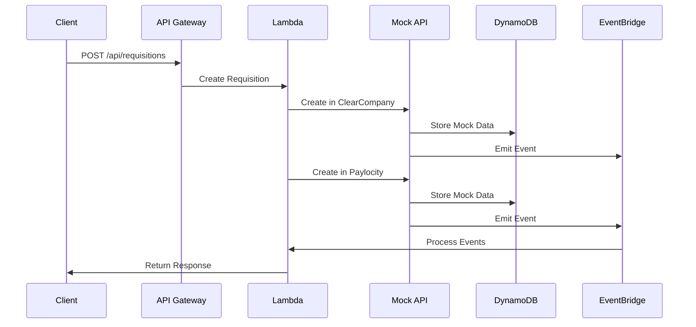
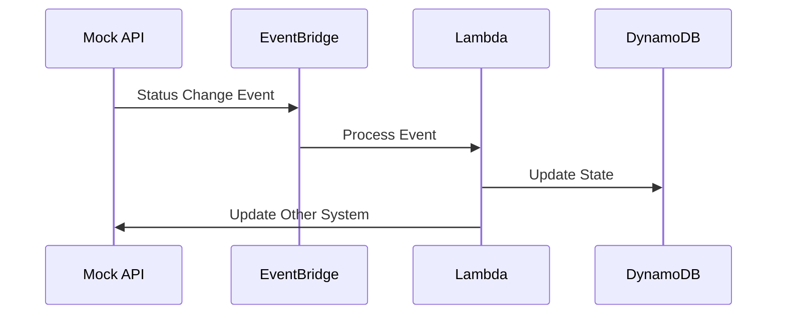

# Architecture Documentation

## Overview

This document describes the architecture of the ClearCompany-Paylocity integration system. The system is built using AWS serverless technologies to provide a robust, scalable, and maintainable integration between ClearCompany's ATS and Paylocity's Headcount Planning Tool.

## System Components

### 1. Core Integration Components

#### API Gateway
- **Main API Gateway**
  - Serves as the main entry point for all HTTP requests
  - Handles API key authentication
  - Implements CORS policies
  - Routes requests to appropriate Lambda functions

- **Mock API Gateway**
  - Separate gateway for mock API endpoints
  - Simulates ClearCompany and Paylocity APIs
  - Used for development and testing
  - Maintains isolation from production traffic

#### Lambda Functions

##### Integration Functions
- **Create Requisition (src/functions/requisition/create.ts)**
  - Creates requisition in ClearCompany
  - Creates corresponding headcount plan in Paylocity
  - Stores integration state in DynamoDB

- **Update Requisition (src/functions/requisition/update.ts)**
  - Updates existing requisition in ClearCompany
  - Updates corresponding headcount plan in Paylocity
  - Updates integration state in DynamoDB

##### Mock API Functions
- **Mock ClearCompany API (src/functions/mocks/clearcompany.ts)**
  - Simulates ClearCompany's API behavior
  - Stores mock data in DynamoDB
  - Emits events via EventBridge

- **Mock Paylocity API (src/functions/mocks/paylocity.ts)**
  - Simulates Paylocity's API behavior
  - Stores mock data in DynamoDB
  - Emits events via EventBridge

##### Webhook Handler
- **Process Webhook (src/functions/webhook/handler.ts)**
  - Handles status updates from both systems
  - Maintains data consistency
  - Processes candidate hiring events
  - Listens to EventBridge events from mock APIs

### 2. Data Storage

#### DynamoDB Tables
- **Integration State Table**
  - Stores integration mappings and state
  - Primary Key: `id` (String)
  - TTL enabled for cleanup

- **Mock ClearCompany Table**
  - Stores mock requisition data
  - Primary Key: `id` (String)
  - TTL enabled for cleanup

- **Mock Paylocity Table**
  - Stores mock headcount plans
  - Primary Key: `id` (String)
  - Global Secondary Index: `requisitionId-index`
  - TTL enabled for cleanup

### 3. Event Management

#### EventBridge
- **Mock Events Bus**
  - Handles events from mock APIs
  - Routes events to webhook handlers
  - Simulates real-time notifications
  - Patterns:
    - `source: mock.clearcompany`
    - `source: mock.paylocity`

### 4. Documentation and Testing

#### API Documentation
- **Swagger/OpenAPI**
  - Hosted on S3 with static website hosting
  - Interactive API documentation
  - Request/response schemas
  - Example requests
  - Authentication details

#### Postman Collection
- **API Testing**
  - Complete request collection
  - Environment configurations
  - Example payloads
  - Pre-request scripts
  - Test scripts

### 5. Security

#### API Authentication
- API Gateway API key requirement
- Secrets Manager for credential storage
- HTTPS-only communication

#### Access Control
- IAM roles for Lambda functions
- Least privilege principle
- Resource-based policies

#### Data Protection
- In-transit encryption (TLS)
- At-rest encryption (DynamoDB, Secrets Manager)
- Input validation and sanitization

## Data Flow

### 1. Requisition Creation

### 2. Status Updates

## Error Handling

### 1. Retry Mechanism
- Exponential backoff for API calls
- DLQ for failed webhook processing
- CloudWatch alarms for monitoring

### 2. Validation
- Request schema validation
- Business rule validation
- Error response standardization

## Monitoring and Logging

### 1. CloudWatch
- Lambda function logs
- API Gateway access logs
- Custom metrics
- Alarms and dashboards

### 2. X-Ray
- Distributed tracing
- Performance monitoring
- Error tracking
- Service map visualization

## Development Environment

### 1. Local Development
- SAM CLI for local testing
- Mock APIs for integration testing
- Environment-specific configurations
- Hot reloading support

### 2. Testing Strategy
- Unit tests with Jest
- Integration tests with mock APIs
- End-to-end testing
- Performance testing

## Deployment Pipeline

### 1. Development Deployment
- SAM template validation
- Automated testing
- Mock API deployment
- Documentation updates

### 2. Production Deployment
- Manual approval process
- Blue-green deployment
- Rollback capability
- Health checks

## Future Improvements

### 1. Technical Enhancements
- WebSocket support for real-time updates
- GraphQL API layer
- Caching layer
- Enhanced monitoring

### 2. Feature Enhancements
- Batch processing
- Advanced error recovery
- Custom field mapping
- Audit logging

### 3. Documentation
- Auto-generated API docs
- Integration guides
- Troubleshooting guides
- Performance tuning guides