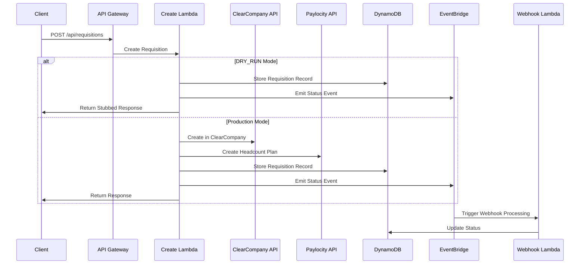
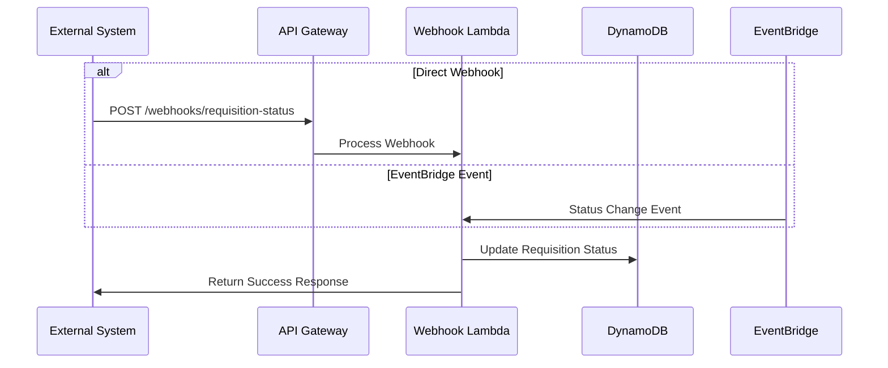

# Architecture Documentation

## Overview

This document describes the architecture of the ClearCompany-Paylocity integration system. The system is built using AWS serverless technologies to provide a robust, scalable, and maintainable integration between ClearCompany's ATS and Paylocity's Headcount Planning Tool.

## System Components

### 1. Core Integration Components

#### API Gateway
- **Main API Gateway**
  - Serves as the main entry point for all HTTP requests
  - Handles API key authentication
  - Implements CORS policies for web applications
  - Routes requests to appropriate Lambda functions
  - Includes health check endpoint for monitoring

#### Lambda Functions

##### Core Functions
- **Health Check (src/functions/health/index.ts)**
  - Simple health check endpoint
  - Returns application status
  - Used for monitoring and load balancer checks

- **Create Requisition (src/functions/requisition/create.ts)**
  - Creates requisition in ClearCompany (or stubbed in DRY_RUN mode)
  - Creates corresponding headcount plan in Paylocity (or stubbed in DRY_RUN mode)
  - Stores requisition data in DynamoDB
  - Publishes EventBridge events for status updates
  - Supports both production and development modes

- **Update Requisition (src/functions/requisition/update.ts)**
  - Updates existing requisition in ClearCompany
  - Updates corresponding headcount plan in Paylocity
  - Updates requisition data in DynamoDB
  - Maintains data consistency across systems

##### Webhook Handler
- **Process Webhook (src/functions/webhook/handler.ts)**
  - Handles direct webhook calls from external systems
  - Processes EventBridge events from internal systems
  - Updates requisition status in DynamoDB
  - Maintains data consistency
  - Supports both API Gateway and EventBridge triggers

### 2. Data Storage

#### DynamoDB Tables
- **Integration State Table**
  - Stores requisition records and integration state
  - Primary Key: `id` (String)
  - Schema: `id`, `title`, `description`, `department`, `location`, `employmentType`, `status`, `createdAt`, `updatedAt`, `headcountPlanId`
  - Pay-per-request billing mode
  - Used for both production and DRY_RUN data persistence

#### Secrets Manager
- **API Credentials Secret**
  - Stores ClearCompany and Paylocity API keys
  - JSON format: `{"clearCompanyApiKey": "...", "paylocityApiKey": "..."}`
  - Encrypted at rest
  - Accessed only in production mode (bypassed in DRY_RUN)

### 3. Event Management

#### EventBridge
- **Application Events Bus**
  - Handles internal application events
  - Routes events to webhook handlers
  - Enables decoupled event-driven architecture
  - Event patterns:
    - `source: com.clearcompany.app`
    - `detail-type: requisition.status_updated`
  - Triggers automatic webhook processing after requisition creation

### 4. Documentation and Testing

#### API Documentation
- **Swagger/OpenAPI**
  - Hosted on S3 with static website hosting
  - Interactive API documentation
  - Request/response schemas
  - Example requests
  - Authentication details

#### Postman Collection
- **API Testing**
  - Complete request collection for all endpoints
  - Production environment configuration
  - Realistic example payloads
  - API key authentication setup
  - Test scripts for validation

### 5. Security

#### API Authentication
- API Gateway API key requirement
- Secrets Manager for credential storage
- HTTPS-only communication

#### Access Control
- IAM roles for Lambda functions
- Least privilege principle
- Resource-based policies

#### Data Protection
- In-transit encryption (TLS)
- At-rest encryption (DynamoDB, Secrets Manager)
- Input validation and sanitization

### 6. Development and Testing Strategy

#### DRY_RUN Mode
- **Purpose**: Enables local development and testing without external API dependencies
- **Configuration**: Set via `DRY_RUN: "true"` environment variable in SAM template
- **Behavior**:
  - Bypasses Secrets Manager access
  - Returns stubbed responses instead of making external API calls
  - Still persists data to DynamoDB for testing workflows
  - Publishes EventBridge events for complete flow testing
  - Generates dynamic UUIDs for realistic data simulation

#### Benefits
- **Cost Optimization**: No external API charges during development
- **Reliability**: Consistent responses for testing
- **Speed**: Faster execution without network dependencies
- **Isolation**: Test business logic without external system dependencies

## Data Flow

### 1. Requisition Creation

### 2. Status Updates

## Error Handling

### 1. Retry Mechanism
- Exponential backoff for API calls
- DLQ for failed webhook processing
- CloudWatch alarms for monitoring

### 2. Validation
- Request schema validation
- Business rule validation
- Error response standardization

## Monitoring and Logging

### 1. CloudWatch
- Lambda function logs
- API Gateway access logs
- Custom metrics
- Alarms and dashboards

### 2. X-Ray
- Distributed tracing
- Performance monitoring
- Error tracking
- Service map visualization

## Development Environment

### 1. Local Development
- SAM CLI for local testing with Docker
- DRY_RUN mode for development without external dependencies
- Environment-specific configurations
- Local DynamoDB testing support

### 2. Testing Strategy
- Unit tests with Jest
- Integration tests with DRY_RUN mode
- End-to-end testing with Postman
- Performance testing with realistic payloads

## Deployment Pipeline

### 1. Development Deployment
- SAM template validation
- TypeScript compilation and linting
- Automated testing with DRY_RUN mode
- Documentation updates

### 2. Production Deployment
- Manual SAM deployment with `--force-upload`
- IAM capability acknowledgment
- Environment-specific parameter overrides
- Health checks via `/health` endpoint

## Future Improvements

### 1. Technical Enhancements
- WebSocket support for real-time updates
- GraphQL API layer
- Caching layer
- Enhanced monitoring

### 2. Feature Enhancements
- Batch processing for multiple requisitions
- Advanced error recovery and retry mechanisms
- Custom field mapping configuration
- Comprehensive audit logging and compliance tracking

### 3. Documentation
- Auto-generated API docs
- Integration guides
- Troubleshooting guides
- Performance tuning guides