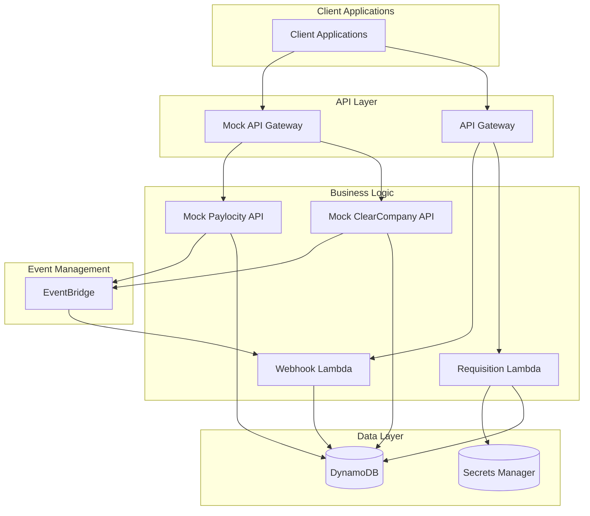
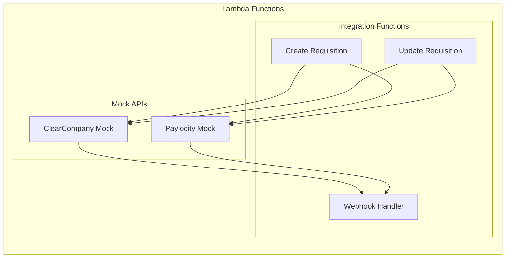
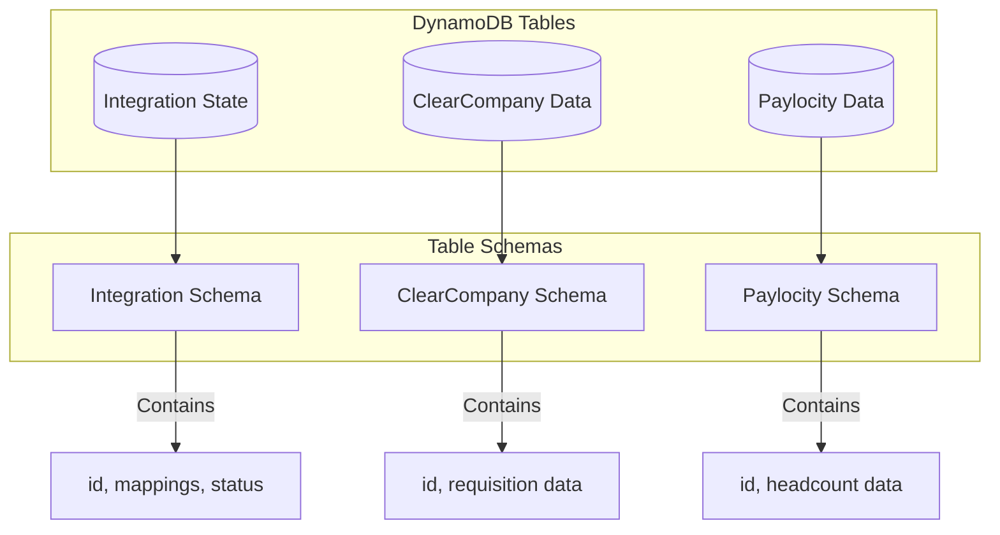
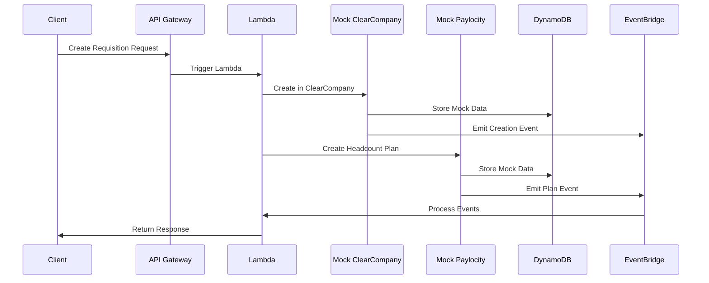
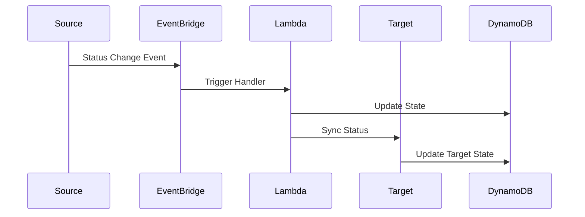
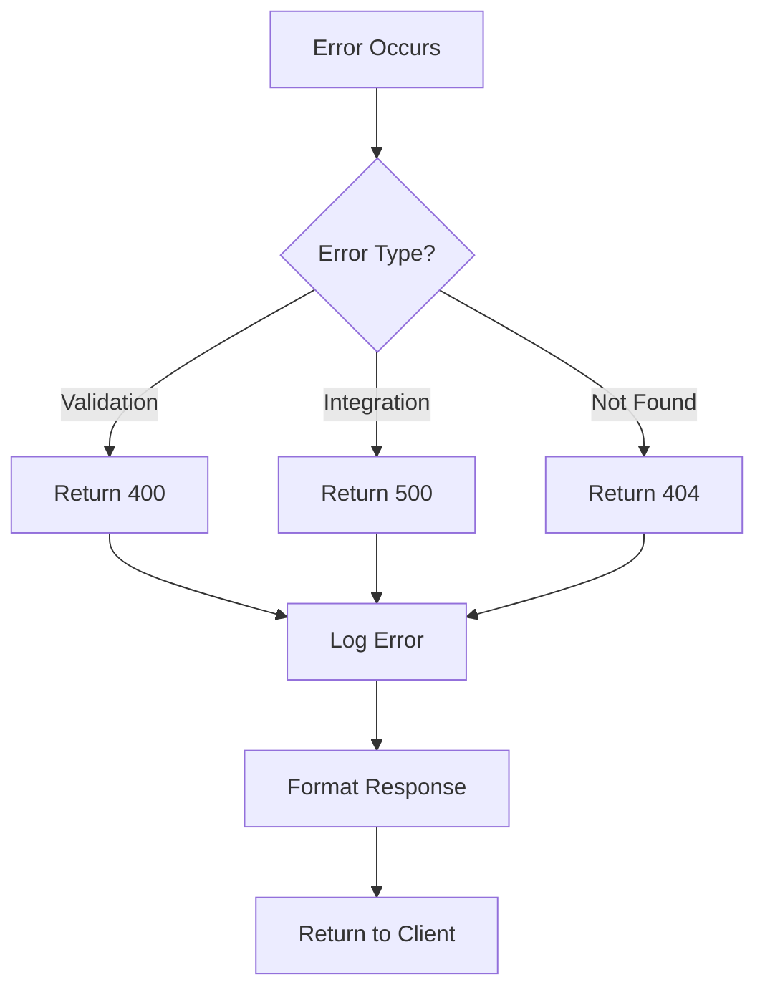
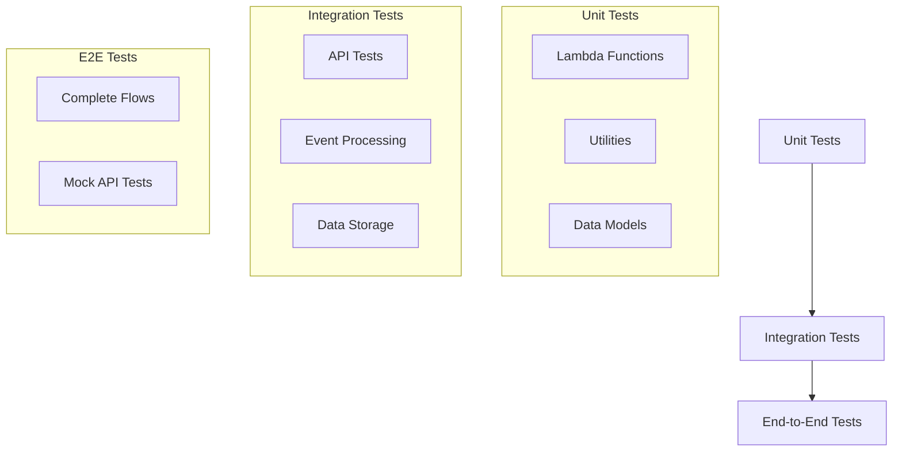
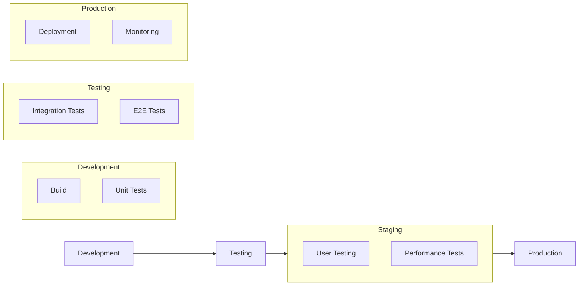
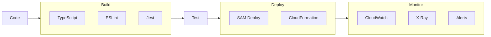
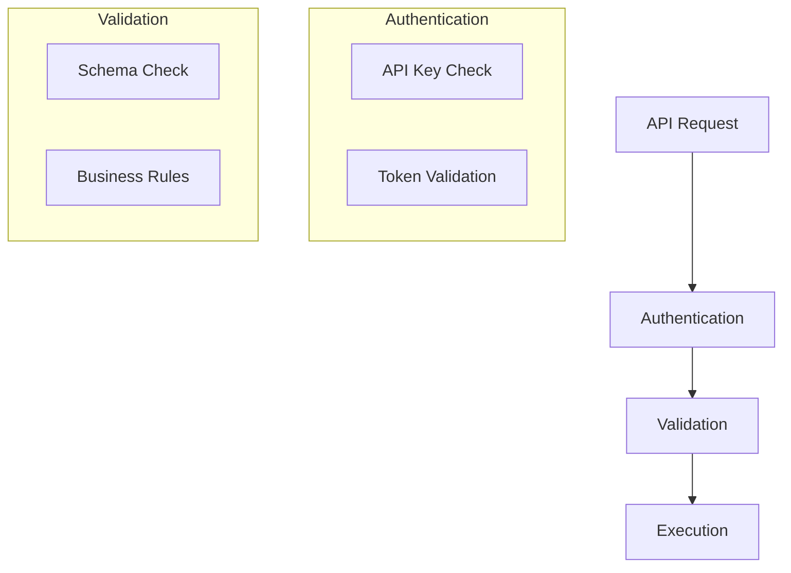

# Solution Approach

## 1. Technical Stack

### 1.1 Core Technologies
- **Runtime**: Node.js 18.x with TypeScript
- **Framework**: AWS SAM (Serverless Application Model)
- **API**: REST with OpenAPI 3.0
- **Database**: Amazon DynamoDB
- **Event Bus**: Amazon EventBridge
- **Documentation**: Swagger UI hosted on S3

### 1.2 Development Tools
- **Build**: esbuild for TypeScript compilation
- **Testing**: Jest with ts-jest
- **Linting**: ESLint with TypeScript rules
- **API Testing**: Postman collections
- **Local Development**: AWS SAM CLI

## 2. System Architecture

### 2.1 High-Level Architecture


### 2.2 Component Details

#### 2.2.1 API Gateway Layer
- Main API Gateway for client interactions
- Separate Mock API Gateway for development
- API key authentication
- CORS support
- Request/response validation

#### 2.2.2 Lambda Functions Layer


#### 2.2.3 Data Storage Layer


## 3. Implementation Approach

### 3.1 Data Flow Patterns

#### 3.1.1 Requisition Creation Flow


#### 3.1.2 Status Update Flow


### 3.2 Code Organization

```
src/
├── functions/
│   ├── requisition/
│   │   ├── create.ts       # Requisition creation
│   │   ├── update.ts       # Requisition updates
│   │   └── schema.ts       # Validation schemas
│   ├── webhook/
│   │   └── handler.ts      # Webhook processing
│   └── mocks/
│       ├── clearcompany.ts # ClearCompany mock
│       └── paylocity.ts    # Paylocity mock
├── lib/
│   ├── clearcompany/
│   │   └── client.ts       # ClearCompany client
│   ├── paylocity/
│   │   └── client.ts       # Paylocity client
│   └── common/
│       ├── errors.ts       # Error handling
│       ├── logger.ts       # Logging
│       └── middleware.ts   # Lambda middleware
└── models/
    └── types.ts            # TypeScript types
```

### 3.3 Error Handling Strategy

#### 3.3.1 Error Categories
```typescript
// Base error class
class BaseError extends Error {
    constructor(
        message: string,
        public statusCode: number = 500,
        public errorCode?: string
    ) {
        super(message);
    }
}

// Specific error types
class ValidationError extends BaseError {
    constructor(message: string) {
        super(message, 400, 'VALIDATION_ERROR');
    }
}

class IntegrationError extends BaseError {
    constructor(message: string) {
        super(message, 500, 'INTEGRATION_ERROR');
    }
}
```

#### 3.3.2 Error Handling Flow


### 3.4 Testing Strategy

#### 3.4.1 Test Layers


## 4. Deployment Strategy

### 4.1 Environment Setup


### 4.2 CI/CD Pipeline


## 5. Monitoring and Observability

### 5.1 Metrics Collection
- API Gateway metrics
- Lambda execution metrics
- DynamoDB throughput
- Event processing metrics

### 5.2 Logging Strategy
```typescript
// Structured logging
const logger = winston.createLogger({
    format: winston.format.json(),
    defaultMeta: { service: 'integration-service' },
    transports: [
        new winston.transports.Console({
            format: winston.format.combine(
                winston.format.timestamp(),
                winston.format.json()
            )
        })
    ]
});
```

### 5.3 Alerting Setup
- CloudWatch Alarms
- Error rate thresholds
- Performance thresholds
- Custom business metrics

## 6. Security Measures

### 6.1 Authentication Flow


### 6.2 Data Protection
- Encryption at rest
- TLS in transit
- Secure credential storage
- Input sanitization

## 7. Scaling Considerations

### 7.1 Lambda Scaling
- Concurrent execution limits
- Memory allocation
- Timeout configuration
- Cold start optimization

### 7.2 DynamoDB Scaling
- On-demand capacity
- Auto-scaling policies
- Partition key design
- GSI optimization

### 7.3 API Gateway Scaling
- Throttling limits
- Burst handling
- Cache configuration
- Stage variables
