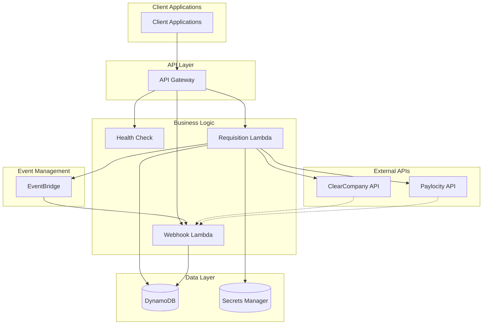
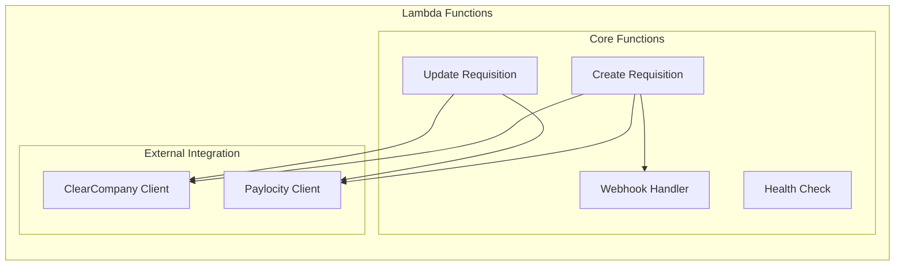
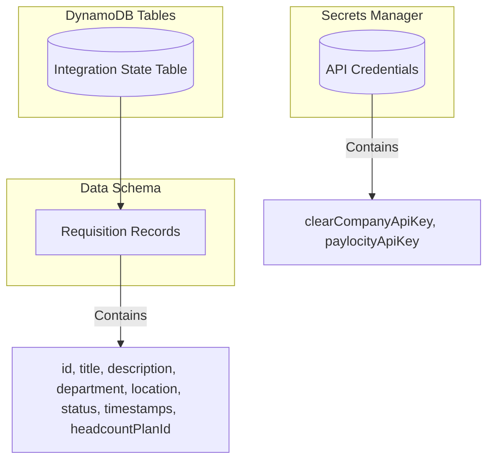
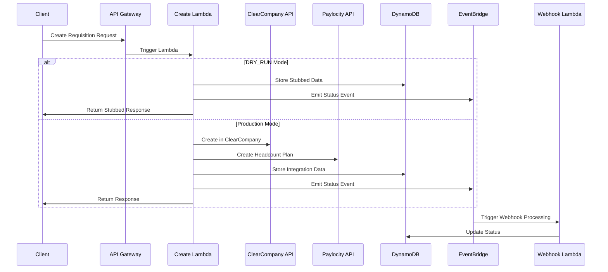
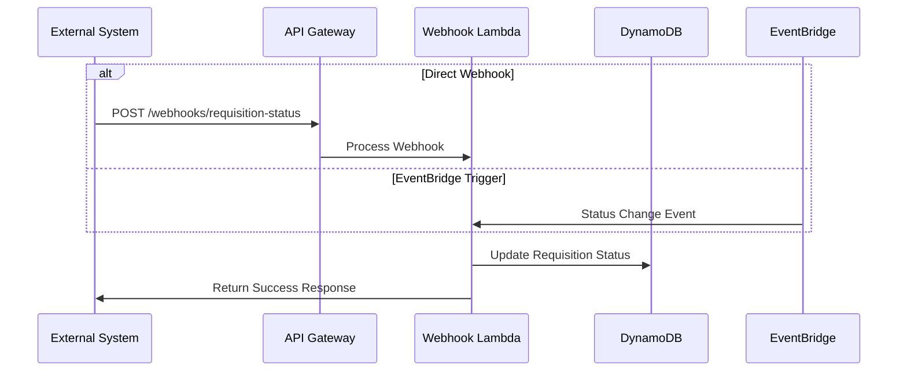
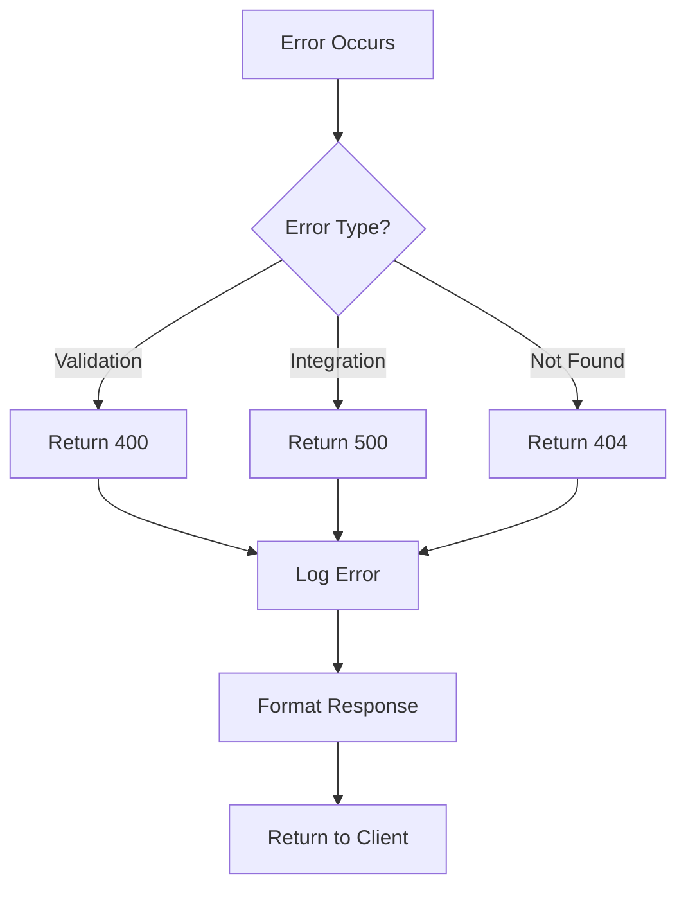
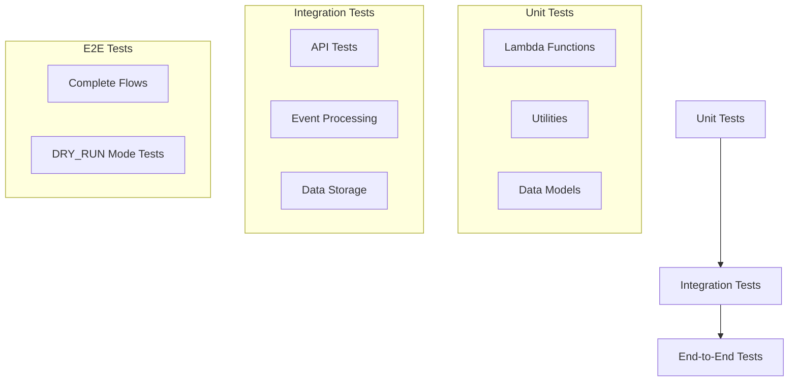
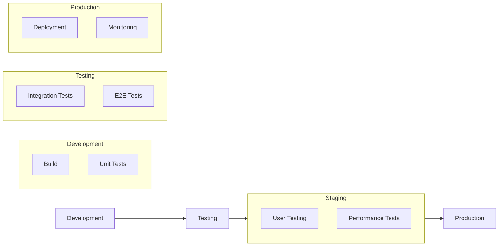
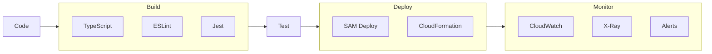
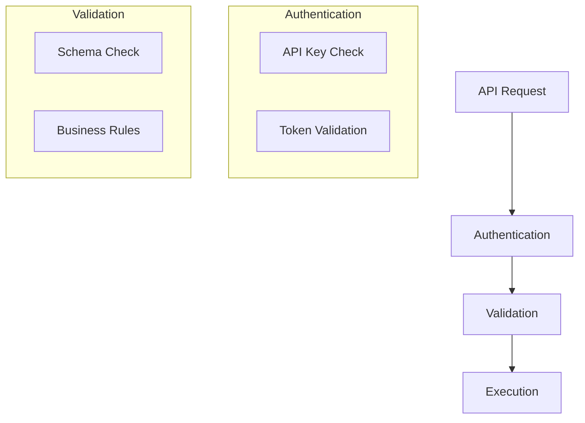

# Solution Approach

## 1. Technical Stack

### 1.1 Core Technologies
- **Runtime**: Node.js 18.x with TypeScript
- **Framework**: AWS SAM (Serverless Application Model)
- **API**: REST with OpenAPI 3.0
- **Database**: Amazon DynamoDB
- **Event Bus**: Amazon EventBridge
- **Documentation**: Swagger UI hosted on S3

### 1.2 Development Tools
- **Build**: esbuild for TypeScript compilation
- **Testing**: Jest with ts-jest
- **Linting**: ESLint with TypeScript rules
- **API Testing**: Postman collections
- **Local Development**: AWS SAM CLI

## 2. System Architecture

### 2.1 High-Level Architecture


### 2.2 Component Details

#### 2.2.1 API Gateway Layer
- Single API Gateway for all client interactions
- API key authentication
- CORS support for web applications
- Request/response validation
- Health check endpoint for monitoring

#### 2.2.2 Lambda Functions Layer


#### 2.2.3 Data Storage Layer


## 3. Implementation Approach

### 3.1 Data Flow Patterns

#### 3.1.1 Requisition Creation Flow


#### 3.1.2 Status Update Flow


### 3.2 Code Organization

```
src/
├── functions/
│   ├── health/
│   │   └── index.ts        # Health check endpoint
│   ├── requisition/
│   │   ├── create.ts       # Requisition creation
│   │   ├── update.ts       # Requisition updates
│   │   └── schema.ts       # Validation schemas
│   └── webhook/
│       └── handler.ts      # Webhook processing
├── lib/
│   ├── clearcompany/
│   │   └── client.ts       # ClearCompany client with DRY_RUN support
│   ├── paylocity/
│   │   └── client.ts       # Paylocity client with DRY_RUN support
│   ├── storage/
│   │   └── requisitions.ts # DynamoDB operations
│   └── common/
│       ├── errors.ts       # Error handling
│       ├── logger.ts       # Logging
│       └── middleware.ts   # Lambda middleware
```

### 3.3 DRY_RUN Mode Implementation

#### 3.3.1 Development and Testing Strategy
The application includes a `DRY_RUN` mode that allows for local development and testing without making actual API calls to external systems.

```typescript
// Environment variable configuration
DRY_RUN: "true"  // Set in template.yaml for development

// Client implementation
if (process.env.DRY_RUN === 'true') {
    logger.info('DRY_RUN enabled, returning stubbed response');
    return new StubbedClient();
}
```

#### 3.3.2 DRY_RUN Benefits
- **Local Development**: Test without external API dependencies
- **Cost Optimization**: Avoid external API charges during development
- **Reliability**: Consistent responses for testing
- **Speed**: Faster execution without network calls
- **Data Persistence**: Still saves data to DynamoDB for testing workflows

### 3.4 Error Handling Strategy

#### 3.4.1 Error Categories
```typescript
// Base error class
class BaseError extends Error {
    constructor(
        message: string,
        public statusCode: number = 500,
        public errorCode?: string
    ) {
        super(message);
    }
}

// Specific error types
class ValidationError extends BaseError {
    constructor(message: string) {
        super(message, 400, 'VALIDATION_ERROR');
    }
}

class IntegrationError extends BaseError {
    constructor(message: string) {
        super(message, 500, 'INTEGRATION_ERROR');
    }
}
```

#### 3.4.2 Error Handling Flow


### 3.5 Testing Strategy

#### 3.5.1 Test Layers


## 4. Deployment Strategy

### 4.1 Environment Setup


### 4.2 CI/CD Pipeline


## 5. Monitoring and Observability

### 5.1 Metrics Collection
- API Gateway metrics
- Lambda execution metrics
- DynamoDB throughput
- Event processing metrics

### 5.2 Logging Strategy
```typescript
// Structured logging
const logger = winston.createLogger({
    format: winston.format.json(),
    defaultMeta: { service: 'integration-service' },
    transports: [
        new winston.transports.Console({
            format: winston.format.combine(
                winston.format.timestamp(),
                winston.format.json()
            )
        })
    ]
});
```

### 5.3 Alerting Setup
- CloudWatch Alarms
- Error rate thresholds
- Performance thresholds
- Custom business metrics

## 6. Security Measures

### 6.1 Authentication Flow


### 6.2 Data Protection
- Encryption at rest
- TLS in transit
- Secure credential storage
- Input sanitization

## 7. Scaling Considerations

### 7.1 Lambda Scaling
- Concurrent execution limits
- Memory allocation
- Timeout configuration
- Cold start optimization

### 7.2 DynamoDB Scaling
- On-demand capacity
- Auto-scaling policies
- Partition key design
- GSI optimization

### 7.3 API Gateway Scaling
- Throttling limits
- Burst handling
- Cache configuration
- Stage variables
